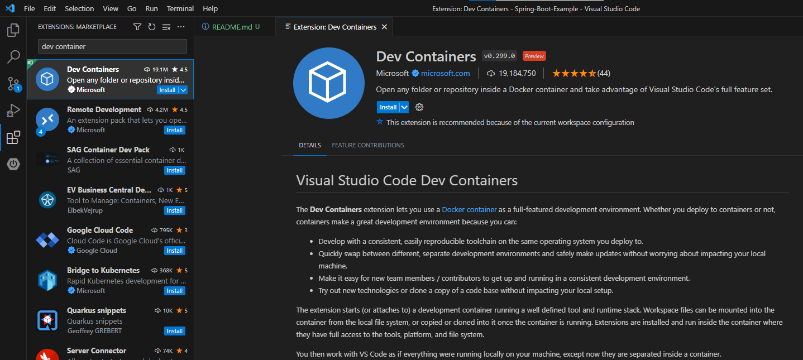

# Spring Boot Sandbox
Welcome to the Spring Boot Sandbox project. The purpose of this repository is to provide a very basic Spring Boot project with minimal setup, so you can experiment and learn about Spring.

## Setup
You'll need to have Visual Studio Code and Docker Desktop installed to use this repository. 

### Visual Studio Code
VS Code is a powerful lightweight IDE. Importantly, with an extension, we can have an environment set up and ready to use with minimal effort.

1. Install [Visual Studio Code](https://code.visualstudio.com/Download).
2. In VS Code, go to the Extensions Marketplace and install the Dev Containers extension.

### Docker Desktop
Docker allows you to run code in a container. We'll use it to run our Visual Studio Code environment.

**Note** You will need a license to use Docker Desktop on a company device. Please obtain one from IT Support.

1. Install [Docker Desktop](https://www.docker.com/products/docker-desktop/).
    * You may need administrator access (or go through Admin by Request) to do this.
    * Leave the default setting to use WSL2 instead of Hyper-V.
2. When prompted, restart your computer.
3. Docker will start automatically.
    * You may get a popup saying Docker Desktop requires a new WSL kernal version. You should be able to run `wsl --update` in Command Prompt to perform this update, and then restart Docker Desktop.
4. Sign in to Docker Desktop when prompted.

### Cloning the Container
Now we have all the tools we need installed, we can open the project in a container.

1. In VS Code, press Ctrl+Shift+P to open the Command Pallet.
2. Search for and run `Dev Containers: Clone Repository in Container Volume...`
    * You may get a popup telling you that the command can run arbitrary code. Since we know we're cloning our own repository here, it's fine and you can answer "Got It"
3. Paste in the URL of this repository, as if you were cloning it normally, and press Enter.
4. It may take some time to spin up a container and get it running. Go make a coffee ☕

Once the environment has set itself up, you can continue to use VS Code as normal. The container comes pre-configured with Java 17 and several VS Code extensions which help with Java and Spring development:
    * [Extension Pack for Java](https://marketplace.visualstudio.com/items?itemName=vscjava.vscode-java-pack)
    * [Spring Boot Dashboard](https://marketplace.visualstudio.com/items?itemName=vscjava.vscode-spring-boot-dashboard)
    * [Spring Boot Tools](https://marketplace.visualstudio.com/items?itemName=vmware.vscode-spring-boot)

## Running the API
Out of the box, the API has a single GET endpoint which returns a simple JSON response containing a response code. To start the API:
1. Go to the Spring Boot Dashboard in the side bar on the left.
2. In the top section (called "Apps") there should be a single entry: `spring-boot-sandbox`. Click the Run button to the right of this entry.
3. The API should start in a few seconds. To check it's working, open a web browser and go to `http://localhost:8080/`. You should see the response `{"responseCode":"0000"}`.

The environment is now set up and ready. You can play around with the code to add or change endpoints.

Good luck learning Java Spring Boot!